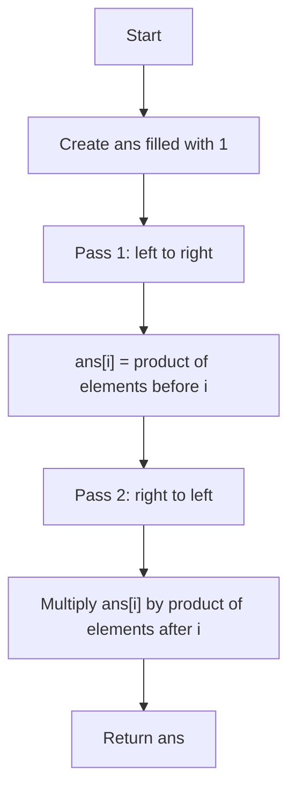

# Product of Array Except Self

<DifficultyBadge level="medium" />

## Description

[Problem Link](https://leetcode.com/problems/product-of-array-except-self/)

Given an integer array `nums`, build an array `ans` where each `ans[i]` is the product of every value in `nums` except `nums[i]`.

You must solve it in linear time and without using division.

### Examples

```txt
Input: nums = [2,3,4,5]
Output: [60,40,30,24]
```
Explanation: `60 = 3 * 4 * 5`, `40 = 2 * 4 * 5`, `30 = 2 * 3 * 5`, `24 = 2 * 3 * 4`.

---

```txt
Input: nums = [1,0,7,2]
Output: [0,14,0,0]
```
Explanation: Only index `1` skips the zero, so that position gets `1 * 7 * 2 = 14`.

---

```txt
Input: nums = [-2,3,-4]
Output: [-12,8,-6]
```
Explanation: `-12 = 3 * (-4)`, `8 = (-2) * (-4)`, `-6 = (-2) * 3`.

### Constraints

- `2 <= nums.length <= 10⁵`
- `-30 <= nums[i] <= 30`
- The product of any prefix or suffix of `nums` fits in a 32-bit integer.
- Do not use division.

## Solution

### Idea

For each index, we need:
- Product of all numbers to its left.
- Product of all numbers to its right.

We can do this in two passes:
1. Left-to-right: store left products in `ans`.
2. Right-to-left: keep a running right product and multiply into `ans`.

This avoids division and uses only constant extra space (not counting output).

<details>
<summary>Show Diagram</summary>



</details>

### Code

```python filename="Python 3"
from typing import List

class Solution:
    def productExceptSelf(self, nums: List[int]) -> List[int]:
        n = len(nums)
        ans = [1] * n

        left = 1
        for i in range(n):
            ans[i] = left
            left *= nums[i]

        right = 1
        for i in range(n - 1, -1, -1):
            ans[i] *= right
            right *= nums[i]

        return ans
```

### Complexity

- Time: `O(n)`. We scan the array twice.
- Space: `O(1)`. Extra space is constant (output array is not counted).

### Logs

```ansi
Input: nums = [2,3,4,5]

Pass 1 (left products):
i=0 left=1  -> ans=[1,1,1,1], left=2
i=1 left=2  -> ans=[1,2,1,1], left=6
i=2 left=6  -> ans=[1,2,6,1], left=24
i=3 left=24 -> ans=[1,2,6,24], left=120

Pass 2 (right products):
i=3 right=1  -> ans[3]=24*1=24, ans=[1,2,6,24], right=5
i=2 right=5  -> ans[2]=6*5=30, ans=[1,2,30,24], right=20
i=1 right=20 -> ans[1]=2*20=40, ans=[1,40,30,24], right=60
i=0 right=60 -> ans[0]=1*60=60, ans=[60,40,30,24], right=120

Output: [60,40,30,24]
```